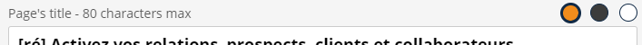
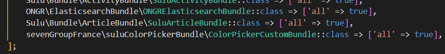
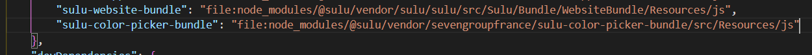
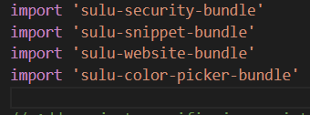
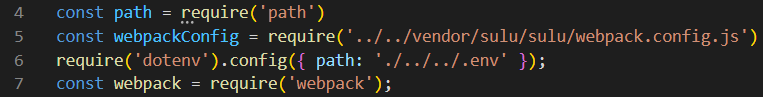
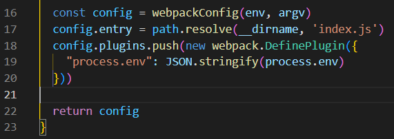
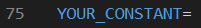
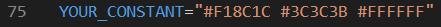

# sevengroupfrance/sulu-color-picker-bundle

Inspired by [this pull request](https://github.com/sulu/sulu-demo/pull/66).

## What is this bundle's goal?
Importing a custom fonctionality into [sulu](https://github.com/sulu/sulu), in this example, a custom content type.
This bundle will make a color picker with a few colors only. This is handy if you don't want to select a color via the normal color picker sulu has.&nbsp;



## Installation
1. Download the [package](https://packagist.org/packages/sevengroupfrance/sulu-color-picker-bundle) in your project with the following command line: 
`composer require sevengroupfrance/sulu-color-picker-bundle`.
2. In `config/bundles.php` add the following code: 
`sevenGroupFrance\suluColorPickerBundle\ColorPickerCustomBundle::class => ['all' => true]`.

3. In `assets/admin/package.json`, add the following line in the "dependencies" object: 
`"sulu-color-picker-bundle": "file:node_modules/@sulu/vendor/sevengroupfrance/sulu-color-picker-bundle/src/Resources/js"`.

4. In `assets/admin`, `npm install` to initialize the bundle's symlink directory.
5. In `assets/admin/index.js`, add this line:
`import 'sulu-color-picker-bundle'`.

6. In `assets/admin`, `npm run watch` or `npm run build`

## dotenv configuration
This bundle uses the .env constants as well as the npm package [dotenv](https://www.npmjs.com/package/dotenv). Install the package in your `assets/admin/node_modules` directory.
Once this is done, add those lines in your `assets/admin/webpack.config.js` file:
At the start of your file:
```
require('dotenv').config({ path: './../../.env' });
const webpack = require('webpack');
```

In the module.export object:
```
config.plugins.push(new webpack.DefinePlugin({
    "process.env": JSON.stringify(process.env)
  }))
```

This will add a new parameters to SULU's webpack.config.js' plugins object and enable your env variables in your js files.

## colors configuration
This part is quite simple.
Open your .env file in your root directory, and add a constant of your choice:

Then, give it a string for its value, with the colors you want:

